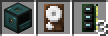
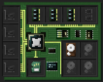
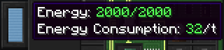
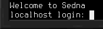

# 入门指南
本文介绍了让[计算机](block/computer.md)启动并运行所需的步骤，并举例说明如何使用计算机与设备进行交互。

## 构建
首先，你需要一台实际的计算机，以及一些组件。如果你还没有这些，先制作以下物品：
- 1台 [计算机](block/computer.md)
- 1个 **Linux** [硬盘](item/hard_drive.md)（普通的8M硬盘，然后用[扳手](item/wrench.md)制作）
- 3个 8M [内存](item/memory.md)

获得所有这些组件后，放置计算机。使用扳手打开其库存界面。或者，打开终端界面，然后使用左侧的切换按钮切换到库存界面。在这里，将制作好的硬盘和内存放入计算机中。

## 启动
要启动你刚刚组装的计算机，通常需要为其提供一些电力。查看终端或库存界面左侧的能量条。其工具提示会告诉你计算机当前储存的能量量，以及每个tick所需的能量量。

确保所需的能量可用后，切换到终端界面并点击左上角的电源按钮。或者，蹲下状态下使用计算机。现在计算机应该会启动！等待直到提示你登录。

输入 `root` 作为用户名进行登录，然后按回车。干得好，现在你有了一台准备就绪的计算机！

你现在可以根据你想要使用计算机的用途添加更多设备。有关如何控制设备的信息，请参阅[脚本编写](scripting.md)手册条目。

祝你好运，最重要的是，玩得开心！
