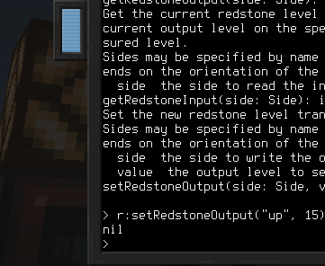

# 脚本编写
使用 Lua 控制设备是使用[计算机](block/computer.md)的核心概念。许多设备是所谓的高级 API (HLAPI) 设备。这意味着它们不是通过常规的 Linux 驱动控制，而是通过一个简单的 RPC 系统，通过串行设备传输 JSON 消息进行控制。

## Devices 库
默认的 Linux 发行版包含了简化 HLAPI 设备访问的库。`devices` 库提供了发现设备、调用设备方法以及在可用时获取设备文档的工具。

要使用 `devices` 库，可以通过 `require("devices")` 导入它。

### 方法
`list():table` 返回当前所有可用设备的列表。返回的表中的每个条目代表一个设备，包括其类型名称和唯一标识符。
- 返回已连接的 HLAPI 设备列表。

`get(id:string):Device` 返回具有指定标识符的设备的封装对象。类似于 `find`，但使用特定的标识符而不是类型名称。
- `id` 是设备的唯一标识符。
- 返回指定设备的封装对象。

`find(typeName):Device` 返回指定类型的设备的封装对象。如果有多个这种类型的设备，则无法确定会返回哪一个。可以使用[总线接口](block/bus_interface.md)中设置的别名。
- `typeName` 是要查找设备的设备类型。
- 返回指定设备类型的设备封装对象。

`methods(id:string):table` 返回具有指定标识符的设备提供的方法列表。要以更可读的方式获取方法列表，请获取设备封装对象并将其转换为字符串。此外，请参阅设备封装对象类型部分。
- `id` 是设备的唯一标识符。
- 返回设备提供的方法列表。
- 如果获取方法列表失败，将抛出错误。

`invoke(id:string, methodName:string, ...):any` 调用具有指定标识符的设备上的指定方法。传递所有额外参数。不建议直接使用此方法。最好获取设备封装对象并通过它调用方法。此外，请参阅设备封装对象类型部分。
- `id` 是设备的唯一标识符。
- `methodName` 是要调用的方法的名称。
- `...` 是传递给方法的参数。
- 返回方法的结果。
- 如果调用失败或方法抛出异常，则抛出错误。

## 设备封装对象
从 `device` 库返回的设备是 `Device` 类型的对象。这是一个存储设备标识符的封装对象。

它的主要作用是允许无缝调用此设备公开的方法，并在可用时以便捷的方式访问文档。

要在这种封装对象上调用方法，请使用冒号符号和方法的名称。例如：  
`wrapper:someMethod(1, 2, 3)`

要获取设备的文档，可以将其转换为字符串。在 Lua 解释器中，使用 `=wrapper`。

## 示例
在此示例中，我们将控制一个[红石接口](block/redstone_interface.md)。首先，放置块并使用[总线线缆](block/bus_cable.md)和[总线接口](block/bus_interface.md)将其连接到计算机。

我们在红石接口上方放置一个红石灯，以便通过视觉指示我们的命令是否生效。

要验证设备与计算机之间的连接，从命令行运行命令 `lsdev.lua`。这将列出所有已连接的 HLAPI 设备的标识符和类型名称。其中一个应在其类型名称中包含 `redstone`。

通过命令行运行 `lua` 启动 Lua 交互模式。

导入 devices 库并将其存储在名为 `d` 的变量中：  
`d = require("devices")`

然后获取红石接口的 `Device` 封装对象，并将其存储在名为 `r` 的变量中：  
`r = d:find("redstone")`

此调用中的 `redstone` 是设备类型名称，正如我们刚刚通过 `lsdev.lua` 检查的一样。

现在我们有了一个红石接口的封装对象，可以在其上调用方法。要获取可用方法的列表，运行 `=r`。

在我们的示例中，我们对 `setRedstoneOutput` 方法感兴趣。它允许设置红石接口发出的信号。

要点亮我们的灯，我们希望从红石接口的顶部发出红石信号：  
`r:setRedstoneOutput("up", 15)`

现在灯应该会亮起来！

通过这些操作，你可以了解已连接设备的名称、它们提供的方法以及如何获取它们的文档。继续尝试使用红石接口的其他方法读取输入的红石信号，或尝试其他设备吧！
